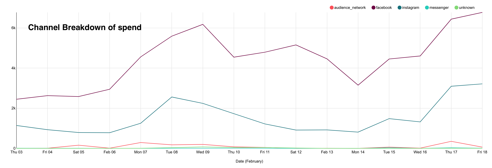
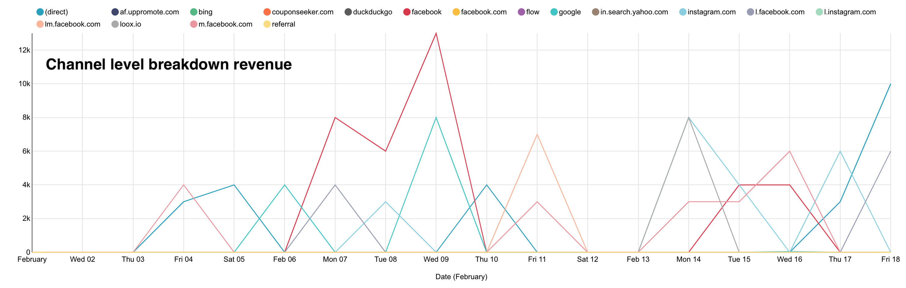

# maaya-labs-project

## Objective 

The objective of this project was to build an efficient and reuseable data pipeline, that helps maaya labs load data into their ad hoc database so the visualization software can automatically pull data from the database into the dashboard.
## ETL data pipeline 

### The process 

`Extract` - Get data from csv files 

`Transform`- Select the necessary columns, rename columns, and change data type 

`Load`- Insert the data into a relational data base

### Tools used 
`Pandas`: for transformation and cleaning 

`Postgres`: relational database

`Apache superset`: data visualization dashboard 

### Schema

**Database** - `company_x `

There are `two tables` in the database:

`General_dashboard`: This contains all user transactions, ranging from the source of traffic to quantity of product bought and total amount spent daily. 

**Schemas**:  
`Table name: general_dashboard` 

*columns*  
`id SERIAL: PRIMARY KEY`  
`date: TIMESTAMP WITHOUT TIME ZONE ` 
`source: TEXT`   
`sessions: BIGINT`  
`organic_searches: BIGINT`  
`users: BIGINT`  
`transactions: BIGINT`  
`transaction_revenue: FLOAT(53)`  
`item_quantity: BIGINT`  
`transactions_per_user: FLOAT(53)`

 

`Publisher`: this contains data about the platform used for running ads, and how much was spent on each platform daily 

**Schemas**  

`Table name: publisher` 

*columns*  
`date: TIMESTAMP WITHOUT TIME ZONE`  
`publisher_platform: TEXT`  
`spend: FLOAT(53)`

### Setup

**From your *terminal/bash/cli*** 
- run `mkdir maaya_labs_data`
- To build docker image **run** `docker build -t maaya-labs .`
- Run `docker-compose -f docker-compose.yaml` to start the postgres database and run scripts

### Visualization

Install **[Apache superset](https://superset.apache.org/docs/installation/installing-superset-using-docker-compose)** using docker

sample visualization

**Channel breakdown of spend per ad platform**

 

**Channel level breakdown of website orders**

 

**Channel level breakdown of revenue**

